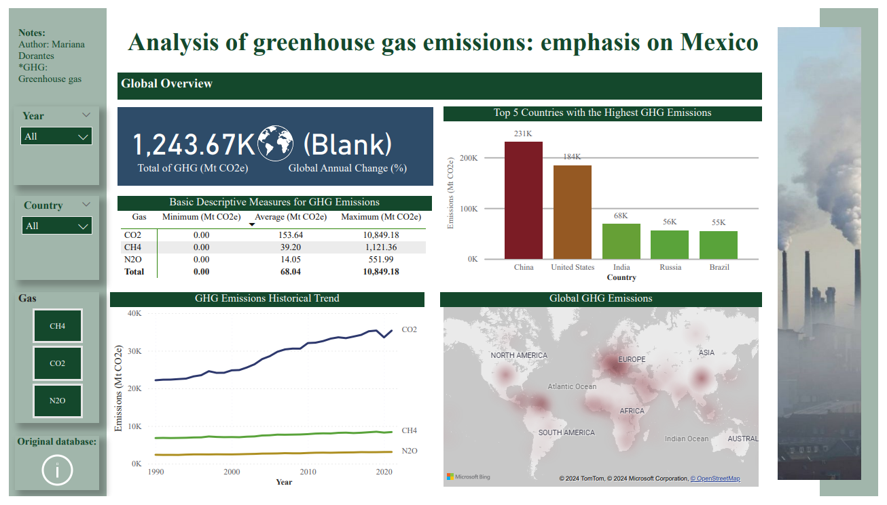
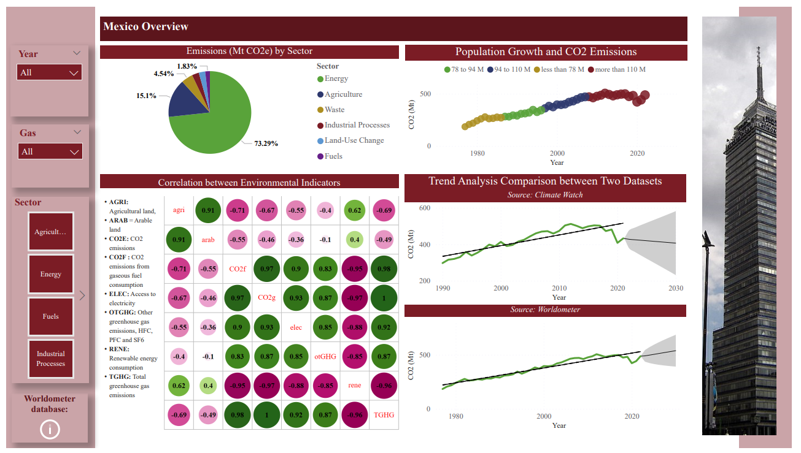

### Welcome to the Power BI Report: **Analysis of greenhouse gas emissions: emphasis on Mexico**

#### Resumen: 

Este reporte contiene información sobre tres gases de efecto invernadero: CO2, N2O y CH4.
Está realizado para dos niveles de estudio uno es global y el otro es enfocado únicamente en México.
Las bases de datos fueron obtenidas de fuentes abiertas:
1. Descarga de archivo de Historical GHG Emissions: https://www.climatewatchdata.org/ghg-emissions
2. Webscrapping con Python (pandas) desde: https://www.worldometers.info/co2-emissions/mexico-co2-emissions/#:~:text=CO2%20emissions%20per%20capita%20in,in%20CO2%20emissions%20per%20capita.

#### Página 1: Emisiones globales

1. Contiene 3 filtros: por año, por país y por gas.
2. Las tarjetas contienen el total de emisiones de efecto invernadero y el cambio global anual respecto al año anterior (para mostrar un valor es necesario seleccionar un año. Ejemplo, el usuario selecciona Año = 1997, dará el valor porcentual de la diferencia entre 1996 y 1997). Esta medida se creó en DAX.
3. La tabla contiene medidas básicas descriptivas como el mínimo, promedio y máximo de cada gas, así como el total.
4. Se muestra la tendencia histórica para los tres gases.
5. Se muestra el top 5 de los países con mayor emisión de gases de efecto invernadero y su total.
6. Se muestra un mapa de calor donde la concentración se indica mediante un tono de rojo más intenso.

   

#### Página 2: Emisiones de México

1. Contiene 3 filtros: por año, por país y por sector.
2. La gráfica de pastel indica el porcentaje de emisiones por sector.
3. El gráfico de correlación se realizó en R, usando la librería "corrplot".
4. Se muestra una gráfica de dispersión del crecimiento de la población y las emisiones de CO2. Los datos se agruparon en 4 categorías mediante la función **SWITCH** (DAX).
5. Se muestra la comparación entre dos fuentes de datos, su respectiva línea de tendencia y proyecciones a futuro.

   
