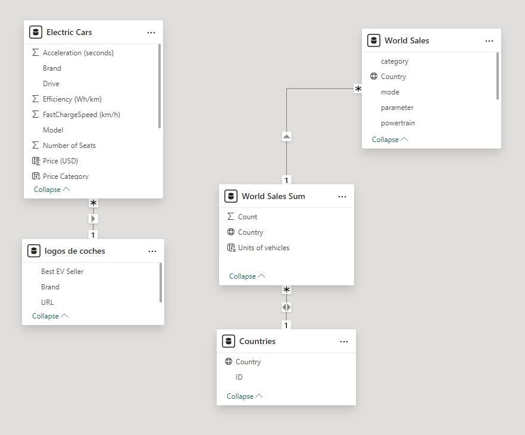
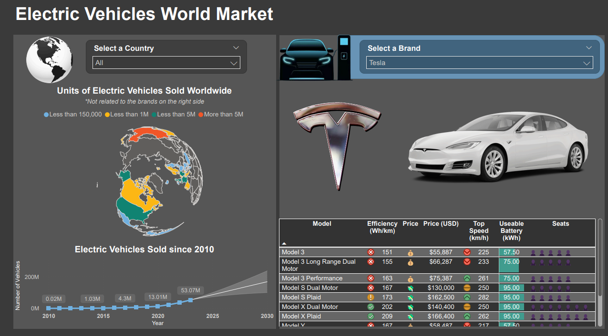

### Welcome to the Power BI Report: Electric Vehicles World Market

#### Overview

This report shows general data on electric car sales globally (from 2010 to 2023) and by car brand available in Europe.
Global sales data was obtained from Kaggle: https://www.kaggle.com/datasets/edsonmarin/historic-sales-of-electric-vehicles Data on car brands, models, and specifications was obtained from https://www.kaggle.com/datasets/kkhandekar/cheapest-electric-cars.

Creation procedure: To build this report, the following steps were performed: 

##### General: 
1. Data cleaning and transformation: Rename columns, split columns, replace values, remove duplicates, remove unnecessary columns, and sort rows.
2. Create Countries table.
3. Create Brand Logos table: contains URLs of images of logos and flagship cars.

##### Part One: Global Sales 
1. This part contains global sales data, which **does not** relate to car brands.
2. To obtain total sales by country, a new table was referenced, which was grouped by country in Power Query.
3. It starts with a map made with JSON and orthographic projection, which responds to the Country filter.
4. Below is the graph of electric car sales growth along with a projection to 2030.
  
##### Part Two: Main Brands
1. Contains a Brand filter that activates the logos and cars shown at the bottom, as well as the table.
2. The table is made up of Model, Efficiency, Price, Speed, Battery Use, and Number of Seats, where each column contains a visual element that helps to interpret the information more quickly.
3. The Price column was made with DAX, using the SWITCH function and adding different emojis to each category.
4. This process was repeated with the column of Seats.

#### Model view:

#### Report view:

